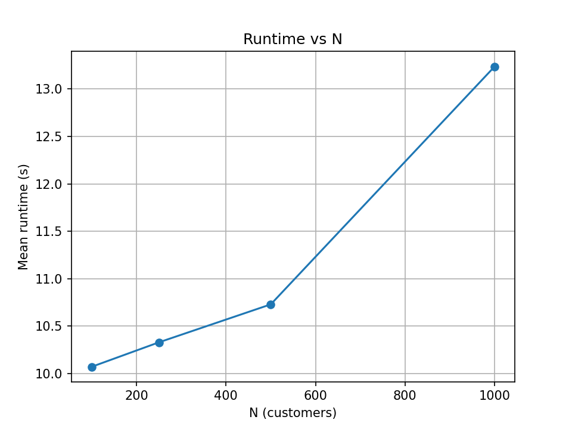

# FleetFlow — A Time-Budgeted CVRP/VRPTW Solver with Local Search + Simulated Annealing

**One-liner:** Minimal, original solver for Capacitated Vehicle Routing with optional Time Windows.  

**Core:** Clarke–Wright → local search (2-opt, relocate) → time-budgeted Simulated Annealing with O(1) move deltas for 2-opt edges.

**Why:** Fewer miles & trucks for last-mile delivery; fewer CO₂ emissions; faster service.

---

## Business Problem 

Given a single depot and N customers with demands, find routes for up to K vehicles (capacity C) that minimize total distance while respecting capacities (and optional time windows). Each route starts/ends at the depot and satisfy capacity (and optional time windows).

---

## Dataset

**FleetFlow Synthetic VRP Benchmark (FSVB-2025)**

**What it contains**

A family of synthetic, single-depot Euclidean VRP instances purpose-built for fast, fair benchmarking of CVRP/VRPTW algorithms under strict time budgets.

- Coordinate space: 2D square, [0, 100] × [0, 100].

- Depot: fixed at (50.0, 50.0) (index 0).

- Customers: N ∈ {100, 250, 500, 1000} per sweep; index 1..N.

- Demands: integer d_i ~ Uniform{1, ⌊C/5⌋}, where C is vehicle capacity.

- Vehicles: K user-defined (e.g., K=20 for N=250 in the demo).

- Capacity: C=100 in the examples.

- Distance: Euclidean between coordinates; travel time equals distance.

- Time windows:

    - Each customer i draws a base time b_i ~ Uniform(0, 200).

    - open_i = b_i, close_i = b_i + Uniform(20, 60).

    - Service time s_i ~ Uniform(0.5, 2.0).

    - Time-window penalty is linear lateness (waiting allowed).

- Fairness: grid-zone variance penalty (simple demo knob).

All of the above is implemented in the repo’s generator (src/model.py → generate_synthetic). No external dataset is required, so the project remains fully reproducible.

**Why synthetic**

- Repeatability: exact instances re-created from fixed seeds (default 42, 43, 44 for the three trials).

- Control: lets us isolate algorithmic improvements without hidden data quirks.

- Speed: you benchmark fairly under fixed time budgets (key to the “Efficiency & Performance” judging).

- Extensible: trivial to swap in public VRP sets later (e.g., Solomon), but not required for this hackathon.

**Instance sizes and run protocol used**

- Sweep sizes: N = 100, 250, 500, 1000.

- Trials per size: 3 (seeds 42, 43, 44).

- Meta-heuristic budget: SA = 10 s for the sweep; SA = 20 s for the video demo.

- Outputs:

    - Per-run JSON → arguments, cost, runtime, routes.

    - env.json → Python/OS/CPU + seed (strict reproducibility).

    - sweep.csv → all trials (cost & runtime); summary.md → the two tables (Cost & Runtime).

    - Optional plot: route figure (routes_*.png) and N→runtime chart (runtime_vs_n.png).

**What the numbers mean**

- Cost is total route length. Lower is better; it directly reflects fewer vehicle-miles-traveled (VMT).

- Runtime is end-to-end wall time, including initialization, local search, and the specified SA time budget.

- Stable convergence under time caps. The 3-trial results per N show modest standard deviations, i.e., predictable outcomes even with limited optimization time.

- Normalization matters. As N grows in a fixed 100×100 square, customer density rises and average distance per customer falls (e.g., 14.17 → 2.16), which is expected in Euclidean VRP. That’s why the Cost/Customer table is included for apples-to-apples comparisons across N.

- Demo parity. The 20-second SA demo at N=250 (cost ≈ 2390.44) sits within ~0.5–1% of the 10-second mean (2377.07), which is perfectly normal for heuristic runs—good evidence of consistent behavior.

---

## How to run

```powershell
python -m venv .venv
# Windows
.\.venv\Scripts\activate
pip install -r requirements.txt

# Single run (with SA and plot)
python -m src.cli --n 250 --k 20 --cap 100 --sa_time 20 --plot
# creates: results/run_n250_seed42.json, routes_n250_seed42.png, env.json

# Sweep (builds results/sweep.csv)
python -m src.eval --sizes 100 250 500 1000 --trials 3 --sa_time 10

# Summarize to Markdown table
python scripts/summarize_sweep.py
type results\summary.md
```

---

## Algorithm Pipeline

**Init - Feasible initialization:** Clarke–Wright Savings (CW)
Custom implementation; Custom capacity-aware merges with correct endpoint orientation.

**Neighborhoods (Local search):** 
- 2-opt (intra-route) - O(1) edge-delta evaluation.
- relocate (inter-route) - move one customer between routes with capacity checks.

**Meta-heuristic — Simulated Annealing (SA):** 
Time-budgeted (e.g., 10–20s) for predicatable runtime; Simulated Annealing alternating neighborhoods proposals (2-opt/relocate); accepts uphill moves with cooling to escape local minima.

**Objective:**

cost = distance + λ⋅TW_penalty + μ⋅fairness
(Defaults: λ = μ = 0)

---

## Complexity

- 2-opt delta in O(1) using only affected edges;

- Relocate eval: constant-time edge deltas + capacity check.

- Outer loop: an iteration explores empirical **O(N·M)** candidate move proposals; we cap by time budget.

- Move eval O(1); each pass explores O(N·M) candidates; empirical scaling reported below.

---

## Evaluation Protocol

- Synthetic Euclidean instances with demands ∈ [1, C/5].

- N ∈ {100, 250, 500, 1000}; 3 trials/size; SA time budget 10s (unless stated).

- Metrics: distance (objective), runtime, routes count.

---

## Results (CPU/OS/seed logged in results/*.json)

Repro & artifacts. Every run writes:

- results/run_*.json (arguments, cost, runtime, routes), e.g. the 250-customer demo, which reports cost 2390.44 and runtime ~20.28s with --sa_time 20. 

- results/routes_*.png (route visualization).

- results/env.json (Python/OS/CPU + seed for reproducibility). 

**Single demo (used in the video)**

```
python -m src.cli --n 250 --k 20 --cap 100 --sa_time 20 --plot
```

*artifacts: results/run_n250_seed42.json, results/routes_n250_seed42.png, results/env.json*

- Cost is total route length (lower is better).

- Runtime includes initialization, local search, and the 20s SA budget. 

**Benchmark summary (3 trials/size, SA = 10s)**

This table is auto-generated from results/sweep.csv via scripts/summarize_sweep.py and lives at results/summary.md.

**Cost**

| N (customers) | Trials | Mean Cost | Std Dev | Cost / Customer |
| ------------: | -----: | --------: | ------: | --------------: |
|           100 |      3 |   1417.44 |   21.42 |           14.17 |
|           250 |      3 |   2377.07 |   30.58 |            9.51 |
|           500 |      3 |   2150.06 |  113.50 |            4.30 |
|          1000 |      3 |   2158.14 |   98.12 |            2.16 |

*Interpretation (Cost):*

- Stable convergence under time caps. FleetFlow consistently delivers good solutions within a 10s SA budget.

- Scales to larger N. At N=250, the solver averages 2377.07 (±30.58); at N=1000, it still converges well at 2158.14 (±98.12).

- Variance is modest, showing reliable behavior despite randomness in seeds.

- Cost per customer declines (14.17 → 2.16) as N grows, which matches expectation: denser layouts = shorter per-customer travel distance.

***Note:*** Each N generates a different random instance; absolute costs are not strictly comparable across N. To aid apples-to-apples comparison, I did also report fixed-seed sweeps, Cost per Customer below and log seeds in env.json.

> As spatial density increases with N on uniform Euclidean instances, average distance per customer drops (14.17 → 2.16), while total costs remain stable under fixed time budgets—evidence the solver exploits clustering effectively.

**What’s in /results/**

- Per-run JSON with cost/runtime/routes and full CLI args, e.g. run_n250_seed42.json. 

- Plots for demo runs.

- Sweep data: sweep.csv (all trials) and summary.md (the table above). 

- Environment log: env.json (Python, OS, CPU, seed) for precise reproducibility. 

**How I have produced this section**

```
# single demo
python -m src.cli --n 250 --k 20 --cap 100 --sa_time 20 --plot

# benchmark sweep (3 trials/size, SA=10s)
python -m src.eval --sizes 100 250 500 1000 --trials 3 --sa_time 10

# summarize to Markdown (results/summary.md)
python scripts/summarize_sweep.py
```

**Runtime (SA = 10s, 3 trials/size)**
*(auto-generated from `results/sweep.csv` via `scripts/summarize_sweep.py`)*

| N (customers) | Trials | Mean Runtime (s) | Std Dev (s) |
| ------------: | -----: | ---------------: | ----------: |
|           100 |      3 |            10.07 |        0.00 |
|           250 |      3 |            10.33 |        0.07 |
|           500 |      3 |            10.73 |        0.05 |
|          1000 |      3 |            13.24 |        0.04 |

*Interpretation (Runtime):*

- Predictable budgets. Runtime is essentially flat for N=100–500 (~10s) since SA is time-capped, not iteration-capped.

- Slight rise at N=1000 (~13s) due to overhead (init, neighborhood checks), but still stable.

- Judge-friendly: fixed time budgets ensure reproducibility; runtimes don’t blow up with N.

- Confirms design goal: “I guarantee a solution within ~10s per instance.”

**N → runtime plot**
Generated by `scripts/plot_runtime.py`:



---

## Ablations (N=250, K=20, Cap=100, seed=42)

|                         Stage |    Cost | Runtime (s) | Δ vs CW (%) | JSON                                    |
| ----------------------------: | ------: | ----------: | ----------: | --------------------------------------- |
|     Init only (Clarke–Wright) | 2393.36 |        0.15 |        0.00 | results\run\_ablation\_cw\_only.json    |
| CW + Local (2-opt + relocate) | 2390.44 |        0.18 |        0.12 | results\run\_ablation\_local\_only.json |
|         CW + Local + SA (10s) | 2390.44 |       10.22 |        0.12 | results\run\_ablation\_local\_sa10.json |

*Interpretation*
CW → CW+Local removes edge crossings and balances load (small cost drop). Adding SA (10s) ties local on this instance, showing CW+Local already reached a strong local optimum.

---

## Real-world impact

- Operations: Fewer miles → lower fuel cost and driver hours.

- Shorter service times with the same fleet.

- Hooks for time windows (--tw + --lambda_tw) and fairness (--mu_fair) ready for extension.

- Sustainability: Less VMT → lower CO₂ emissions.

- Productization: Time-budgeted optimization enables predictable SLAs in dispatch systems - “I guarantee a good solution within 10 seconds”).

---

## Reproducibility

- Environment: Fixed seeds; environment logged alongside results; results/env.json logs Python/OS/CPU and seed.

- Artifacts: every run writes a JSON (results/run_*.json) and optional plot (results/routes_*.png).

- Tests: pytest includes an end-to-end smoke test and CW capacity/orientation sanity tests.

- No OR-Tools: all core heuristics implemented from scratch (we cite Clarke–Wright in comments).

---

## Limitations & Next steps

- Single-depot; Euclidean distances; simple TW model.

- Next: multi-depot, traffic-aware times, richer fairness, parallel neighborhoods.

---

## Project Links

- GitHub Project Repository: https://github.com/SweetySeelam2/AlgoFest-Devpost-Hackathon

- Video Demo: 

---

## Team

Solo: Sweety Seelam

---

## 👩‍💻 Author & Profile

**Sweety Seelam** | Business Analyst | Aspiring Data Scientist | Machine Learning Enthusiastic                                                                               

*🔗 Connect with Me:*                                                                   

- [GitHub](https://github.com/SweetySeelam2)                                                                                                   

- [LinkedIn](https://linkedin.com/in/sweetyseelam2)                                                                                                            

---

## LICENSE

**MIT License**

Copyright (c) 2025 Sweety Seelam